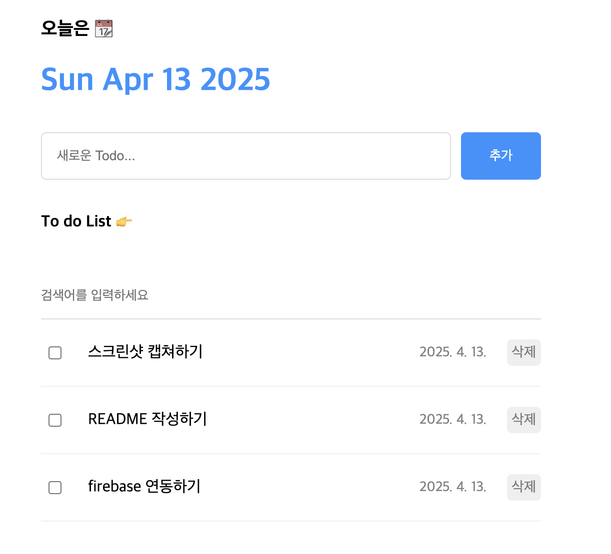
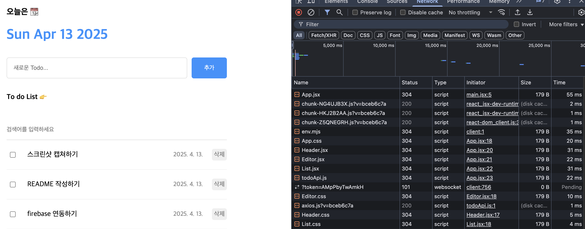
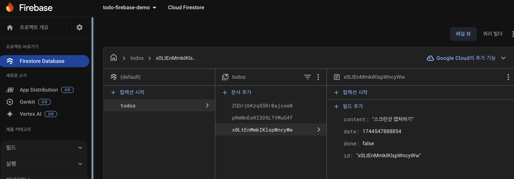
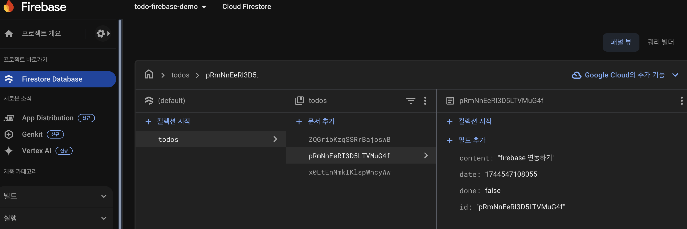

# 📌 TodoList_js

React + Spring Boot + Firebase 연동 기반의 풀스택 투두리스트 애플리케이션입니다.  
프론트엔드는 Vite 기반 React로 구성되어 있고, 백엔드는 Spring Boot로 Firebase Firestore와 연동되어 데이터를 실시간 처리합니다.

---

## 📸 Project Appearance

| Main UI                                      | DevTools (React Network)                     |
|----------------------------------------------|----------------------------------------------|
|  |  |

| Firebase DB - Document | Firebase DB - Detail View |
|------------------------|---------------------------|
|  |  |

## 🛠️ 기술 스택

| 구분      | 기술                                             |
|---------|------------------------------------------------|
| 프론트엔드   | React 19, Vite, Axios                          |
| 백엔드     | Java 17, Spring Boot 3.4.4, Firebase Admin SDK |
| 데이터베이스  | Firebase Firestore                             |
| 배포 (로컬) | Vite 개발서버 : localhost:5173                                   |

---

## 📂 프로젝트 구조

```
TodoList_js/
├── backend/            # Spring Boot 백엔드 (Firebase 연동)
│   └── src/main/java/com.todo.backend
│       ├── controller/     # TodoController (CRUD)
│       ├── model/          # Todo.java
│       ├── FirebaseConfig  # 키 로딩 설정
│       └── application.yml # firebase-key.json 경로 설정
├── frontend/           # React 프론트엔드
│   └── todolist/
│       ├── src/
│       │   ├── components/  # Header, List, TodoItem 등
│       │   └── apis/        # todoApi.js
│       └── vite.config.js   # proxy 설정
```

---

## 🚀 실행 방법

### ✅ 1. Firebase 설정

1. [Firebase 콘솔](https://console.firebase.google.com)에서 프로젝트 생성
2. Firestore Database → 시작 → "todos" 컬렉션 자동 생성
3. 서비스 계정 → 새 비공개 키 발급 → `backend/src/main/resources/firebase-key.json` 저장
4. `application.yml`에 다음 내용 추가:

```yaml
firebase:
  config-path: classpath:firebase-key.json
```

---

### ✅ 2. 백엔드 실행

```bash
cd backend
./gradlew bootRun
```

> Spring Boot가 8080 포트로 실행되며 Firebase에 연결됩니다.

---

### ✅ 3. 프론트엔드 실행

```bash
cd frontend/todolist
npm install
npm run dev
```

> Vite 개발 서버는 기본적으로 `localhost:5173`에서 실행됩니다.

---

## 🧪 테스트

```bash
# 1. 백엔드 실행 (Firebase 연결 포함)
cd backend
./gradlew bootRun
✅ Firebase Initialized
Tomcat started on port 8080

# 2. 프론트엔드 실행 (Vite 개발 서버)
cd ../frontend/todolist
npm install        # 최초 실행 시 1회만
npm run dev

# 3. 렌더링
http://localhost:5173

```

> Firebase 연동된 실제 CRUD 테스트 실행

---

## ✅ 구현 기능

- [x] 할 일 등록 (POST)
- [x] 전체 목록 조회 (GET)
- [x] 완료 상태 토글 (PATCH)
- [x] 할 일 삭제 (DELETE)
- [x] 검색 기능 (프론트)

---

## 🙋‍♂️ 개발자

- 본 프로젝트의 **프론트엔드 UI 로직 구조**는  
  👉 [인프런 한입 리액트 강의](https://www.inflearn.com/course/%ED%95%9C%EC%9E%85-%EB%A6%AC%EC%95%A1%ED%8A%B8/dashboard) 내용을 참고하였습니다.

